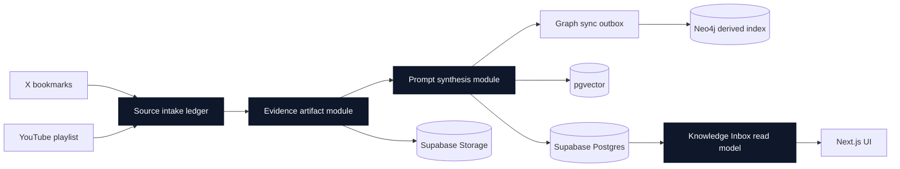

# Second Brain Architecture Overview

Supabase Postgres is the canonical source of truth for source identity,
processing state, synthesis cache rows, and artifact metadata. Supabase Storage
holds raw and derived text artifacts such as X article bodies and YouTube
transcripts. `pgvector` and Neo4j are derived indexes fed after source-grounded
records exist in Supabase.
