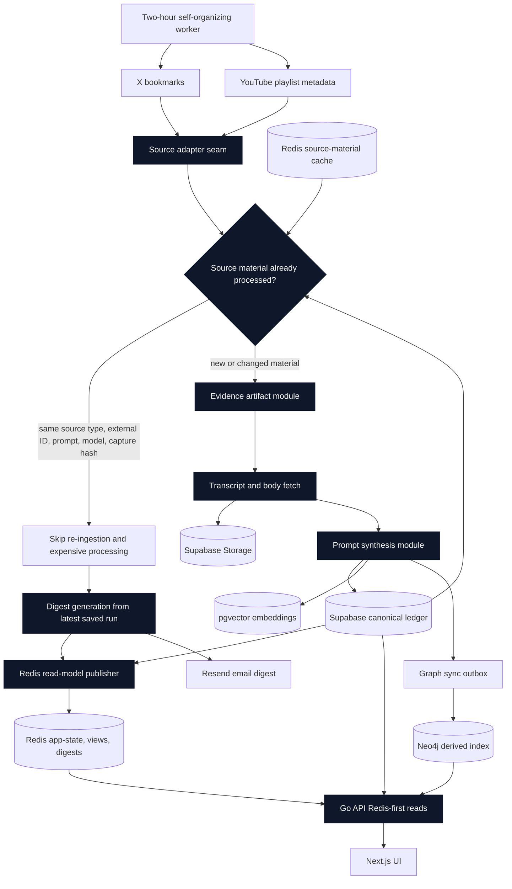

# Second Brain Architecture Overview

Supabase Postgres is the canonical source of truth for source identity,
capture hashes, synthesis cache rows, digest records, and artifact metadata.
Redis stores derived source-material and read-model state so scheduled refreshes
can skip already processed captures before transcript fetches, synthesis,
embeddings, storage rewrites, and graph sync.

Supabase Storage holds raw and derived text artifacts such as X article bodies
and YouTube transcripts. `pgvector` and Neo4j are derived indexes fed after
source-grounded records exist in Supabase. Digest generation remains active even
when refresh work is skipped because there is no new source material.
