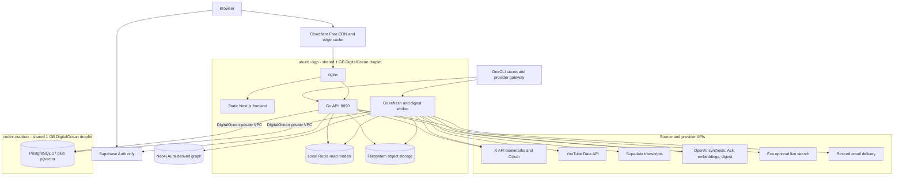

# Second Brain Production Architecture

Audited on 2026-06-04.



## Ownership Boundaries

- PostgreSQL plus filesystem object storage is the canonical source of truth.
- PostgreSQL runs on `codex-crapbox` and is reachable from `ubuntu-sgp` only over
  the DigitalOcean private VPC.
- Redis on `ubuntu-sgp` stores rebuildable source-material indexes and
  precomputed frontend read models.
- Neo4j Aura is a rebuildable derived graph index. The application can continue
  serving canonical and vector-backed data when graph sync is unavailable.
- Supabase provides Auth only. Supabase Database and Storage are not runtime
  fallbacks.
- Cloudflare provides the public CDN and edge cache on its Free plan. nginx can
  still serve the application directly if Cloudflare caching is unavailable.
- OneCLI currently injects provider credentials and fronts provider calls. The
  Go services can use direct environment credentials instead.

## Runtime Flow

The worker fetches X bookmarks and YouTube metadata, obtains transcripts, and
uses AI providers when configured. It persists canonical records and vectors to
PostgreSQL, writes source artifacts to the private filesystem, best-effort
syncs Neo4j, and publishes Redis read models. Cloudflare caches the public
static frontend and cacheable app-state responses.

Normal page loads use:

```text
Cloudflare -> nginx -> Go API -> Redis read model -> PostgreSQL fallback
```

Protected operator actions use a Supabase Auth bearer session. Digest email
delivery uses Resend after the digest has already been persisted.

## Current Operational Risks

- Both droplets have only 1 GB RAM and are shared with other workloads.
  `ubuntu-sgp` already uses swap, and Redis has no memory ceiling. Do not add
  PostgreSQL to that host.
- `codex-crapbox` is both the production database host and a remote development
  box. Development activity can affect database availability.
- Database dumps and filesystem archives currently live on `ubuntu-sgp`, the
  same host as the object store. There is no recurring offsite backup.
- Filesystem object storage is a single-host dependency. Losing the
  `ubuntu-sgp` disk loses objects that are not in a separate backup.
- Removing OneCLI without first moving its provider secrets and X token
  rotation path will stop refresh/provider calls.

See [the service exit plan](../docs/service-exit-plan.md) before shutting down
or replacing any provider.
